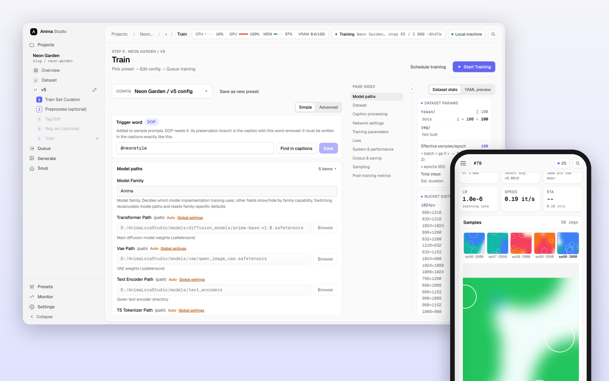
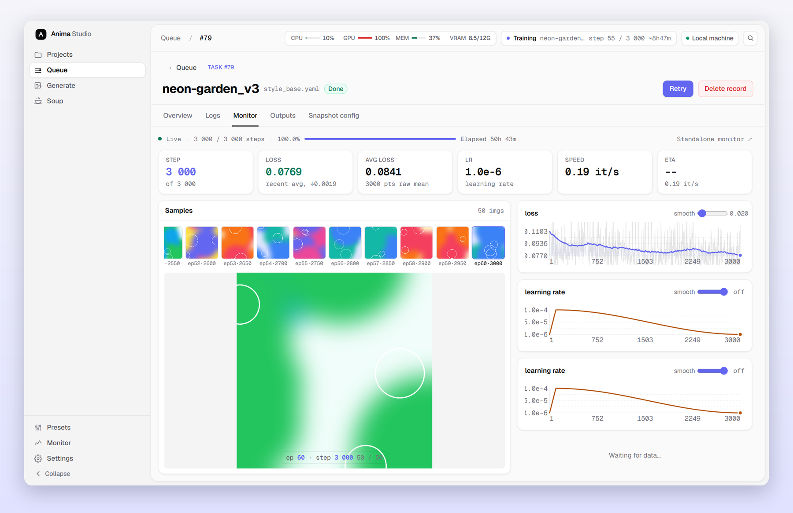
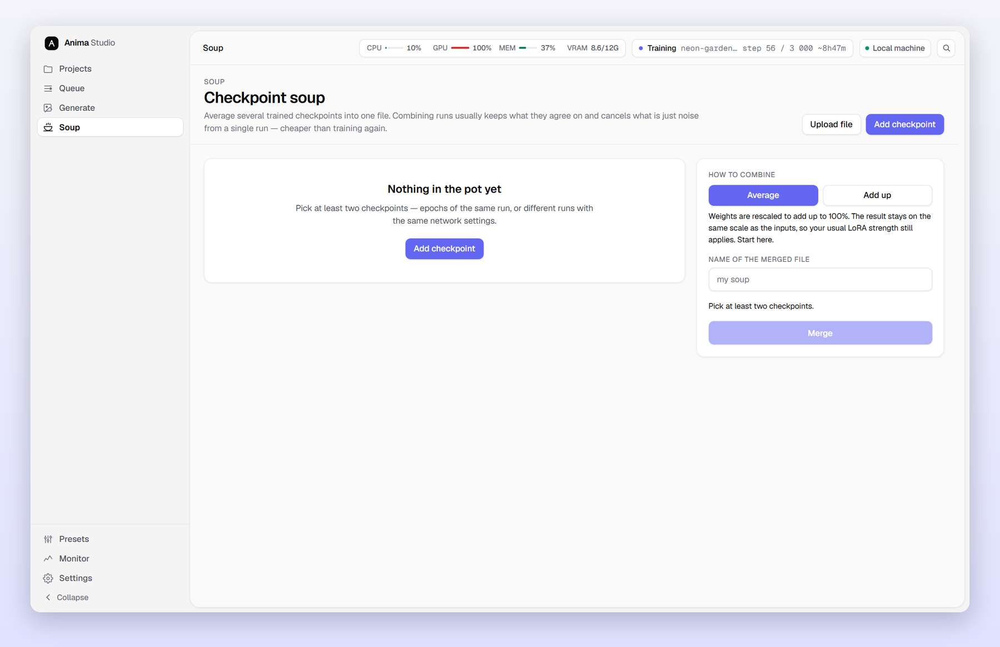
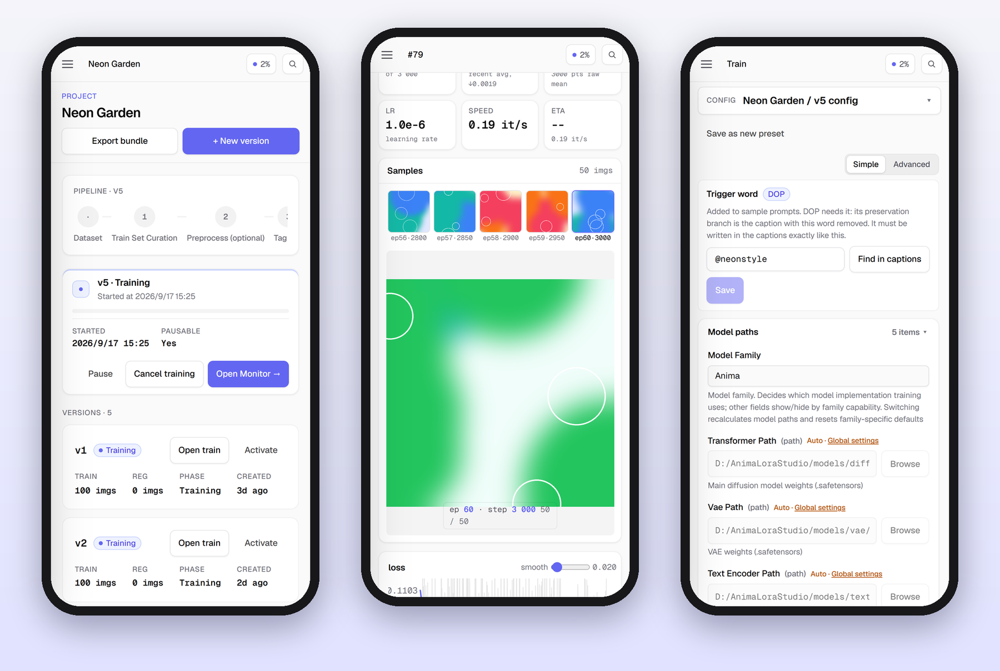
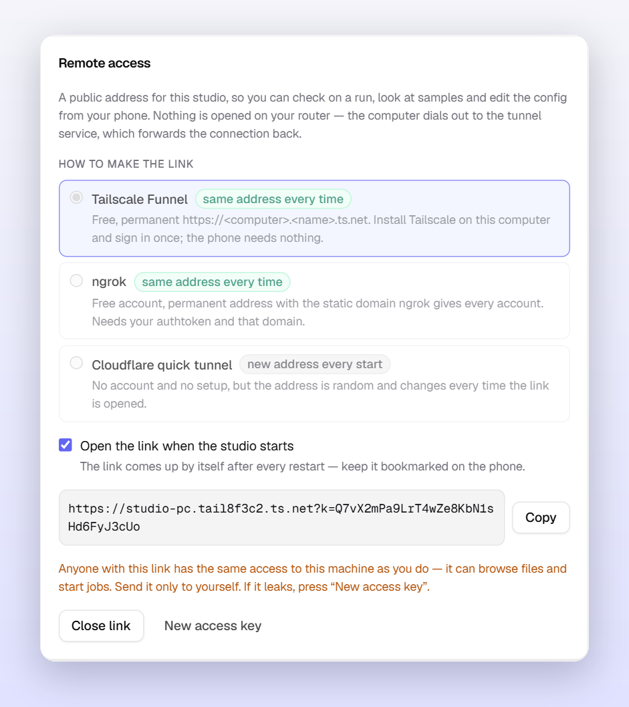

<div align="center">

# Anima LoRA Studio

**A local studio for training LoRA / LoKr adapters for Anima and Krea 2.**<br>
From raw images to test renders in a single browser window, including from your phone.

[](README.ru.md)
[](CHANGELOG.md)
[](LICENSE)
[](#requirements)
[](#)

[Features](#features) · [Differences from upstream](#differences-from-upstream) · [Quick start](#quick-start) · [From your phone](#from-your-phone) · [Documentation](#documentation)

<br>



</div>

<br>

## At a glance

<table>
<tr>
<td width="50%" valign="top">

**🧭 The whole cycle in one place**<br>
Dataset → curation → preprocess → tags → reg set → training → queue → monitor → generation. The current step is highlighted in the sidebar and configs save themselves.

</td>
<td width="50%" valign="top">

**📖 Every setting explains itself**<br>
All 182 training options carry a plain-language description and a recommended value, in English or Russian, right next to the field.

</td>
</tr>
<tr>
<td valign="top">

**📱 Works from your phone at a permanent link**<br>
Tailscale Funnel or ngrok give you an address that never changes. The "open on startup" checkbox brings the link up by itself, and every page is laid out for a phone.

</td>
<td valign="top">

**🪶 Trains on 6 GB**<br>
Block swap, fp8, latent and text-encoder caches, NaViT packing. Before you start you see the step count, the expected time and whether it fits in VRAM.

</td>
</tr>
</table>

<br>

## Features

### 🗂 Dataset
- **Import** images and zip archives by drag & drop or from the server's disk, scrape Booru, see format and size stats.
- **Curation**: a two-pane "dataset → train" view, `N_name` concept folders with repeats, a separate validation set.
- **Preprocess** *(optional)*: perceptual-hash duplicate review, upscaling (ESRGAN / Real-ESRGAN), cropping with aspect-ratio clustering, inpainting. Every action can be undone.
- **Tag editor**: bulk add / remove / replace, dedupe, tag distribution, dictionary autocomplete, restore points.
- **Regularization set**: generated by the base model (DreamBooth-style prior) or pulled from Booru based on the train set's tag distribution.

### 🎛 Training
- **Projects and versions**: one dataset, many versions, each with its own config, reg set and outputs.
- **Two-way presets**: save a version's config as a global preset, or pull a preset into a version.
- **Config form**: Simple / Advanced modes, section index, YAML preview, autosave.
- **An honest estimate before you start**: step count, expected time (measured from your own last run) and a VRAM check using the same arithmetic as the OOM guard.
- **GPU queue**: pause with progress saved, resume, hold the queue, schedule a start.
- **Monitoring**: loss / LR curves, per-step samples, logs, output files with a zip export.



### 🧪 Algorithms
| | |
|---|---|
| **Adapters** | LoRA and LyCORIS (LoKr / LoHa, DoRA, rs-LoRA, dropout), per-layer ranks via `lora_rank_rules` |
| **Optimizers** | AdamW, Lion, Automagic, Prodigy, Prodigy + ScheduleFree ([how to choose](docs/user-guide/optimizers.md)) |
| **Loss** | MSE / Huber with `min_snr`, `cosmap`, `detail_inv_t` weighting and more |
| **Timesteps** | `uniform`, `logit_normal`, `mode`, `mixed_uniform`, InfoNoise, Style-Friendly SNR ([details](docs/style-friendly-snr.md)) |
| **Against overfitting** | EMA of the adapter weights and DOP, differential output preservation ([details](docs/ema-and-dop.md)) |
| **Memory** | block swap (Anima from 6 GB, Krea 2 on 16 GB), fp8, caches, NaViT packing ([details](docs/navit-packing.md)) |
| **Attention** | xformers / flash-attn / PyTorch SDPA |

### 🎨 Generation and comparison
- Single images and XY matrices over parameters, served by a persistent daemon.
- Prompts straight from dataset captions, several LoRAs with individual weights.
- **Checkpoint soup**: average several epochs or runs into one file and test it right away. Incompatible checkpoints are refused up front with the reason.



### ⚙️ Environment
- The first launch creates a `venv`, picks a PyTorch build for your driver (cu118–cu130) and installs dependencies.
- All caches (pip, HuggingFace, torch, npm) stay inside the project folder.
- One-click model downloads (HuggingFace, your own mirror or ModelScope), custom VAEs and text encoders, local base models.
- **Local** and **Colab** modes, English and Russian UI, command palette on `Ctrl + K`.

Outputs are saved as `lora_unet_*` and load into ComfyUI without conversion.

<br>

## From your phone



Every page is laid out for a phone: columns stack, the monitor takes the full width, crop handles and thumbnail checkboxes work with a finger.

<table>
<tr>
<td width="46%" valign="top">

</td>
<td valign="top">

**Settings → Remote access**

| Provider | Address | What you need |
|---|---|---|
| **Tailscale Funnel** | permanent `https://<computer>.<tailnet>.ts.net` | Tailscale on this computer, sign in once |
| **ngrok** | permanent, on the free static domain | authtoken and domain from the ngrok dashboard |
| **Cloudflare** | new on every start | nothing |

1. Pick a provider. Tailscale is the easiest way to get a permanent link.
2. Press **Open link**. On the first start Tailscale may ask you to allow Funnel; the link to do that appears right in the panel.
3. Turn on **Open the link when the studio starts** and bookmark the link on your phone.

Nothing is opened on your router. The link carries a persistent access key, and the studio does not answer without it. If the link leaks, **New access key** revokes every old one.

</td>
</tr>
</table>

<br>

## Differences from upstream

This is a fork of [WalkingMeatAxolotl/AnimaLoraStudio](https://github.com/WalkingMeatAxolotl/AnimaLoraStudio). The training core and backend are synced with upstream v0.20.2. Everything a person actually touches is reworked:

- **A new interface** on the [Tailark](https://tailark.com) design system (zinc + indigo, Geist), fully translated into English and Russian, with no Chinese left in the UI.
- **An explanation for every setting**, plus recommended starting values.
- **An honest estimate before you start**: steps, time and VRAM.
- **A phone layout and remote access** at a permanent link, with autostart and an access key.
- **Checkpoint soup**, EMA, DOP (with a trigger-word field that can read the word back from the captions), Style-Friendly SNR.
- **Local / Colab modes**, chosen on first launch.
- **Backported from upstream v0.21–v0.25**: training-side block swap and fixes for memory leaks and spurious OOMs. NaViT packing now works together with block swap.
- Not backported: generation-side block swap, the v0.22 evaluation page rework and GPU selection on multi-GPU machines.

<br>

## Quick start

**1. Prepare your system**: an NVIDIA driver, Python 3.10+, Node.js 18+ (builds the UI), Git.

**2. Clone and launch**

```bash
git clone https://github.com/DualChimerra/AnimaTrainHub
cd AnimaTrainHub
```

- **Windows**: double-click `AnimaLoraStudio.exe` (or run `studio.bat`).
- **Linux / macOS**: `./studio.sh`.

The first launch takes a while: it sets up the environment, downloads PyTorch for your GPU and builds the UI. Then <http://127.0.0.1:8765> opens.

**3. Download models**: **Settings → Models**, one button per model family. Files go to `./models/`.

<details>
<summary><b>Commands and flags</b></summary>

```bash
python -m studio              # build the UI if needed and start the server
python -m studio dev          # dev mode: Vite :5173 + uvicorn :8765 --reload
python -m studio build        # build the UI only
python -m studio test         # pytest + vitest

studio.bat --torch=cu128      # force a specific PyTorch build
studio.bat --reinstall        # recreate venv (studio_data is kept)
AnimaLoraStudio.exe --check   # diagnostics: Python, venv, GPU, cache paths

python tools/download_models.py                  # every model from HuggingFace
python tools/download_models.py --modelscope     # via ModelScope
python tools/download_models.py --endpoint URL   # via your own mirror
```

</details>

<details>
<summary><b>How a LoRA gets made</b></summary>

```
Dataset ─▶ 1. Curation ─▶ 2. Preprocess ─▶ 3. Tags ─▶ 4. Reg set ─▶ 5. Train ─▶ Queue / Monitor ─▶ Generate
                          (optional)                  (optional)
```

1. **Projects → New project.** The first version is created automatically.
2. **Dataset.** Upload images or a zip with captions.
3. **Curation.** Move what you want into train, group it into concepts, optionally set aside a validation set.
4. **Preprocess.** Remove duplicates, upscale small images, crop, or skip the step.
5. **Tags.** Clean up captions with bulk operations.
6. **Reg set.** Generate one with the base model, collect one from Booru, or skip the step.
7. **Train.** Pick a preset, adjust parameters, enter the trigger word if you use DOP, and press **Start training**.
8. **Queue / Monitor.** Watch loss, samples and logs; pause and resume.
9. **Generate.** Test epochs with single renders or an XY matrix, and blend the best into a soup.

</details>

<br>

## Requirements

| | Minimum | Recommended |
|---|---|---|
| **GPU** | NVIDIA 6 GB (Anima + block swap) | NVIDIA 16 GB+ |
| **RAM** | 16 GB | 32 GB (block swap pins up to 3.6 GB for Anima and ~11 GB for Krea 2 fp8) |
| **Storage** | SSD, ~20 GB for models and environment | SSD with headroom for latent caches and samples |

| Model | Architecture | Text encoder | Adapters |
|---|---|---|---|
| [**Anima**](https://huggingface.co/circlestone-labs/Anima) | Cosmos-Predict2 DiT, 2B | Qwen3-0.6B | LoRA, LoKr, LoHa |
| **Krea 2** | single-stream MMDiT (fp8 base supported) | Qwen3-VL-4B | LoRA, LoKr, LoHa |

AMD GPUs and Apple Silicon are not supported.

<br>

## Documentation

| Section | Contents |
|---|---|
| [docs/user-guide](docs/user-guide/) | captions and tags, regularization, optimizers, training parameters, custom models |
| [docs/ema-and-dop.md](docs/ema-and-dop.md) · [docs/style-friendly-snr.md](docs/style-friendly-snr.md) · [docs/navit-packing.md](docs/navit-packing.md) | EMA and DOP, Style-Friendly SNR, NaViT packing |
| [docs/architecture](docs/architecture/) · [docs/adr](docs/adr/) | how the studio is built, architecture decisions |
| [studio/README.md](studio/README.md) · [runtime/training/README.md](runtime/training/README.md) | backend and frontend modules, training core and plugins |
| [CONTRIBUTING.md](CONTRIBUTING.md) · [CHANGELOG.md](CHANGELOG.md) | development process and release history |

<details>
<summary><b>Repository layout</b></summary>

```
AnimaLoraStudio/
├── runtime/        # training core, generation, inference daemon (usable from the CLI)
├── studio/         # web studio: FastAPI (api / services / domain / infrastructure / workers)
│   └── web/        # UI: React + Vite + Tailwind
├── modeling/       # model implementations
├── utils/          # shared training utilities
├── tools/          # CLI: model downloads, torch selection, flash-attn install, launcher build
├── models/         # weights and tokenizers (large files are not in git)
├── studio_data/    # projects, database, presets, tasks (created on first run)
└── docs/           # documentation
```

</details>

<br>

## Acknowledgements

- Original project: [WalkingMeatAxolotl/AnimaLoraStudio](https://github.com/WalkingMeatAxolotl/AnimaLoraStudio).
- Training scripts derive from [Moeblack/AnimaLoraToolkit](https://github.com/Moeblack/AnimaLoraToolkit).
- Model and VAE: [circlestone-labs/Anima](https://huggingface.co/circlestone-labs/Anima). Adapters: [LyCORIS](https://github.com/KohakuBlueleaf/LyCORIS).
- Other algorithm and code sources are listed in [THIRD_PARTY_NOTICES.md](THIRD_PARTY_NOTICES.md).

## License

The code is released under **GPL-3.0** ([LICENSE](LICENSE)). Some third-party components (NVIDIA Cosmos, Wan2.1) are Apache-2.0 ([LICENSE-APACHE](LICENSE-APACHE)). Model weights (Anima, Qwen, VAE) have their own licenses, including non-commercial restrictions: check the model cards.

<div align="center">
<sub>Screenshots use demo data.</sub>
</div>
