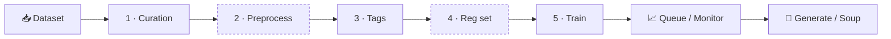

<div align="center">

# AnimaTrainHub

**A local studio for training LoRA / LoKr adapters for Anima and Krea 2.**<br>
From raw images to test renders in a single browser window, including from your phone.

[](README.ru.md)
[](CHANGELOG.md)
[](LICENSE)
[](#requirements)
[](#)

[Features](#features) · [Differences from upstream](#differences-from-upstream) · [Quick start](#quick-start) · [From your phone](#from-your-phone) · [Documentation](#documentation)

<br>


</div>

<br>

## At a glance

<table>
<tr>
<td width="50%" valign="top">

**🧭 The whole cycle in one place**<br>
Dataset → curation → preprocess → tags → reg set → training → queue → monitor → generation. The current step is highlighted in the sidebar and configs save themselves.

</td>
<td width="50%" valign="top">

**📖 Every setting explains itself**<br>
All 182 training options carry a plain-language description and a recommended value, in English or Russian, right next to the field.

</td>
</tr>
<tr>
<td valign="top">

**📱 Works from your phone at a permanent link**<br>
Tailscale Funnel or ngrok give you an address that never changes. The "open on startup" checkbox brings the link up by itself, and every page is laid out for a phone.

</td>
<td valign="top">

**🪶 Trains on 6 GB**<br>
Block swap, fp8, latent and text-encoder caches, NaViT packing. Before you start you see the step count, the expected time and whether it fits in VRAM.

</td>
</tr>
</table>

<br>

## Features

### 🗂 Dataset
- **Import** images and zip archives by drag & drop or from the server's disk, scrape Booru, see format and size stats.
- **Curation**: a two-pane "dataset → train" view, `N_name` concept folders with repeats, a separate validation set.
- **Preprocess** *(optional)*: perceptual-hash duplicate review, upscaling (ESRGAN / Real-ESRGAN), cropping with aspect-ratio clustering, inpainting. Every action can be undone.
- **Tag editor**: bulk add / remove / replace, dedupe, tag distribution, dictionary autocomplete, restore points.
- **Regularization set**: generated by the base model (DreamBooth-style prior) or pulled from Booru based on the train set's tag distribution.

### 🎛 Training
- **Projects and versions**: one dataset, many versions, each with its own config, reg set and outputs.
- **Two-way presets**: save a version's config as a global preset, or pull a preset into a version.
- **Config form**: Simple / Advanced modes, section index, YAML preview, autosave.
- **An honest estimate before you start**: step count, expected time (measured from your own last run) and a VRAM check using the same arithmetic as the OOM guard.
- **GPU queue**: pause with progress saved, resume, hold the queue, schedule a start.
- **Monitoring**: loss / LR curves, per-step samples, logs, output files with a zip export.


### 🧪 Algorithms
| | |
|---|---|
| **Adapters** | LoRA and LyCORIS (LoKr / LoHa, DoRA, rs-LoRA, dropout), per-layer ranks via `lora_rank_rules` |
| **Optimizers** | AdamW, Lion, Automagic, Prodigy, Prodigy + ScheduleFree ([how to choose](docs/user-guide/optimizers.md)) |
| **Loss** | MSE / Huber with `min_snr`, `cosmap`, `detail_inv_t` weighting and more |
| **Timesteps** | `uniform`, `logit_normal`, `mode`, `mixed_uniform`, InfoNoise, Style-Friendly SNR ([details](docs/style-friendly-snr.md)) |
| **Against overfitting** | EMA of the adapter weights and DOP, differential output preservation ([details](docs/ema-and-dop.md)) |
| **Memory** | block swap (Anima from 6 GB, Krea 2 on 16 GB), fp8, caches, NaViT packing ([details](docs/navit-packing.md)) |
| **Attention** | xformers / flash-attn / PyTorch SDPA |

### 🎨 Generation and comparison
- Single images and XY matrices over parameters, served by a persistent daemon.
- Prompts straight from dataset captions, several LoRAs with individual weights.
- **Checkpoint soup**: average several epochs or runs into one file and test it right away. Incompatible checkpoints are refused up front with the reason.


### ⚙️ Environment
- The first launch creates a `venv`, picks a PyTorch build for your driver (cu118–cu130) and installs dependencies.
- All caches (pip, HuggingFace, torch, npm) stay inside the project folder.
- One-click model downloads (HuggingFace, your own mirror or ModelScope), custom VAEs and text encoders, local base models.
- **Local** and **Colab** modes, English and Russian UI, command palette on `Ctrl + K`.

Outputs are saved as `lora_unet_*` and load into ComfyUI without conversion.

<br>

## From your phone


Every page is laid out for a phone: columns stack, the monitor takes the full width, crop handles and thumbnail checkboxes work with a finger.

<table>
<tr>
<td width="46%" valign="top">

</td>
<td valign="top">

**Settings → Remote access**

| Provider | Address | What you need |
|---|---|---|
| **Tailscale Funnel** | permanent `https://<computer>.<tailnet>.ts.net` | Tailscale on this computer, sign in once |
| **ngrok** | permanent, on the free static domain | authtoken and domain from the ngrok dashboard |
| **Cloudflare** | new on every start | nothing |

1. Pick a provider. Tailscale is the easiest way to get a permanent link.
2. Press **Open link**. On the first start Tailscale may ask you to allow Funnel; the link to do that appears right in the panel.
3. Turn on **Open the link when the studio starts** and bookmark the link on your phone.

Nothing is opened on your router. The link carries a persistent access key, and the studio does not answer without it. If the link leaks, **New access key** revokes every old one.

</td>
</tr>
</table>

<br>

## Differences from upstream

> [!NOTE]
> AnimaTrainHub started as a fork of [WalkingMeatAxolotl/AnimaLoraStudio](https://github.com/WalkingMeatAxolotl/AnimaLoraStudio). The training core and backend are synced with upstream **v0.20.2**. Everything a person actually touches is reworked.

<table>
<tr>
<td width="33%" valign="top">

**🎨 Interface**<br>
New design on [Tailark](https://tailark.com) (zinc + indigo, Geist). Fully in English and Russian, no Chinese left in the UI.

</td>
<td width="33%" valign="top">

**📖 Explanations**<br>
Every setting has a plain description and a recommended starting value.

</td>
<td width="33%" valign="top">

**⏱ Honest estimate**<br>
Steps, time and VRAM are shown before you press Start.

</td>
</tr>
<tr>
<td valign="top">

**📱 Phone + remote access**<br>
Phone layout on every page and a permanent link with autostart and an access key.

</td>
<td valign="top">

**🧪 Training toolbox**<br>
Checkpoint soup, EMA, DOP with a trigger-word field, Style-Friendly SNR.

</td>
<td valign="top">

**☁️ Local / Colab**<br>
Runtime mode chosen on first launch: binding, browser and data location follow it.

</td>
</tr>
</table>

**Backported from upstream v0.21–v0.25:** training-side block swap (Krea 2 on 16 GB, Anima on 6 GB), fixes for memory leaks and spurious OOMs; NaViT packing now works together with block swap.<br>
**Not backported:** generation-side block swap, the v0.22 evaluation page rework, GPU selection on multi-GPU machines.

<br>

## Quick start

<table>
<tr>
<td width="33%" valign="top">

### 1 · Prepare

- NVIDIA driver
- Python **3.10+**
- Node.js **18+** (builds the UI)
- Git

</td>
<td width="33%" valign="top">

### 2 · Launch

```bash
git clone https://github.com/DualChimerra/AnimaTrainHub
cd AnimaTrainHub
```

**Windows**: `AnimaLoraStudio.exe` or `studio.bat`<br>
**Linux / macOS**: `./studio.sh`

</td>
<td width="33%" valign="top">

### 3 · Get models

Open **Settings → Models** and press download for your model family. Files go to `./models/`.

Then create a project and follow the sidebar.

</td>
</tr>
</table>

> [!TIP]
> The first launch takes a while: it creates the environment, downloads PyTorch for your GPU and builds the UI. Then <http://127.0.0.1:8765> opens by itself.

### How a LoRA gets made



<sub>Dashed steps are optional.</sub>

<details>
<summary><b>Step by step</b></summary>

<br>

| Step | What you do |
|---|---|
| **Projects → New project** | The first version is created automatically |
| **Dataset** | Upload images or a zip with captions, or scrape Booru |
| **Curation** | Move what you want into train, group it into concepts, set aside a validation set |
| **Preprocess** | Remove duplicates, upscale small images, crop — or skip |
| **Tags** | Clean up captions with bulk operations |
| **Reg set** | Generate one with the base model, collect one from Booru — or skip |
| **Train** | Pick a preset, adjust parameters, enter the trigger word for DOP, press **Start training** |
| **Queue / Monitor** | Watch loss, samples and logs; pause and resume |
| **Generate** | Test epochs with single renders or an XY matrix, blend the best into a soup |

</details>

<details>
<summary><b>Commands and flags</b></summary>

```bash
python -m studio              # build the UI if needed and start the server
python -m studio dev          # dev mode: Vite :5173 + uvicorn :8765 --reload
python -m studio build        # build the UI only
python -m studio test         # pytest + vitest

studio.bat --torch=cu128      # force a specific PyTorch build
studio.bat --reinstall        # recreate venv (studio_data is kept)
AnimaLoraStudio.exe --check   # diagnostics: Python, venv, GPU, cache paths

python tools/download_models.py                  # every model from HuggingFace
python tools/download_models.py --modelscope     # via ModelScope
python tools/download_models.py --endpoint URL   # via your own mirror
```

</details>

<br>

## Requirements

<table>
<tr>
<td width="50%" valign="top">

#### 🖥 Hardware

| | Minimum | Recommended |
|---|---|---|
| **GPU** | NVIDIA 6 GB | NVIDIA 16 GB+ |
| **RAM** | 16 GB | 32 GB |
| **Disk** | SSD, ~20 GB | SSD with headroom |

<sub>6 GB works for Anima with block swap. Block swap pins up to 3.6 GB of RAM for Anima and ~11 GB for Krea 2 fp8.</sub>

</td>
<td width="50%" valign="top">

#### 🧠 Models

| Model | Base | Text encoder |
|---|---|---|
| [**Anima**](https://huggingface.co/circlestone-labs/Anima) | Cosmos-Predict2 DiT, 2B | Qwen3-0.6B |
| **Krea 2** | single-stream MMDiT, fp8 base supported | Qwen3-VL-4B |

<sub>Both train LoRA, LoKr and LoHa; outputs load into ComfyUI as they are.</sub>

</td>
</tr>
</table>

> [!WARNING]
> AMD GPUs and Apple Silicon are not supported.

<br>

## Documentation

<table>
<tr>
<td width="50%" valign="top">

**📘 [User guide](docs/user-guide/)**<br>
Captions and tags, regularization, optimizers, training parameters, custom models.

</td>
<td width="50%" valign="top">

**🧪 Algorithms**<br>
[EMA and DOP](docs/ema-and-dop.md) · [Style-Friendly SNR](docs/style-friendly-snr.md) · [NaViT packing](docs/navit-packing.md)

</td>
</tr>
<tr>
<td valign="top">

**🏗 Architecture**<br>
[How the studio is built](docs/architecture/) · [Decision records](docs/adr/) · [Backend and frontend](studio/README.md) · [Training core and plugins](runtime/training/README.md)

</td>
<td valign="top">

**🤝 Project**<br>
[Contributing](CONTRIBUTING.md) · [Changelog](CHANGELOG.md) · [Third-party notices](THIRD_PARTY_NOTICES.md)

</td>
</tr>
</table>

<details>
<summary><b>Repository layout</b></summary>

```
AnimaTrainHub/
├── runtime/        # training core, generation, inference daemon (usable from the CLI)
├── studio/         # web studio: FastAPI (api / services / domain / infrastructure / workers)
│   └── web/        # UI: React + Vite + Tailwind
├── modeling/       # model implementations
├── utils/          # shared training utilities
├── tools/          # CLI: model downloads, torch selection, flash-attn install, launcher build
├── models/         # weights and tokenizers (large files are not in git)
├── studio_data/    # projects, database, presets, tasks (created on first run)
└── docs/           # documentation
```

</details>

<br>

## Acknowledgements

| Part | Source |
|---|---|
| **Original project** | [WalkingMeatAxolotl/AnimaLoraStudio](https://github.com/WalkingMeatAxolotl/AnimaLoraStudio) |
| **Training scripts** | [Moeblack/AnimaLoraToolkit](https://github.com/Moeblack/AnimaLoraToolkit) |
| **Model and VAE** | [circlestone-labs/Anima](https://huggingface.co/circlestone-labs/Anima) |
| **Adapters** | [LyCORIS](https://github.com/KohakuBlueleaf/LyCORIS) |
| **Everything else** | [THIRD_PARTY_NOTICES.md](THIRD_PARTY_NOTICES.md) |

## License

Code: **GPL-3.0** ([LICENSE](LICENSE)). Some third-party components (NVIDIA Cosmos, Wan2.1) are **Apache-2.0** ([LICENSE-APACHE](LICENSE-APACHE)).

> [!IMPORTANT]
> Model weights (Anima, Qwen, VAE) have their own licenses, including non-commercial restrictions. Check the model cards before using a trained LoRA commercially.

<br>

<div align="center">

**AnimaTrainHub** · made for people who train LoRAs, not for people who read training scripts

<sub>Screenshots use demo data.</sub>

</div>
