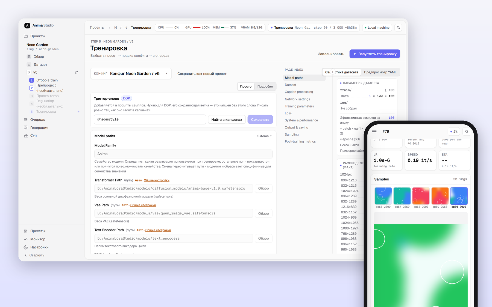
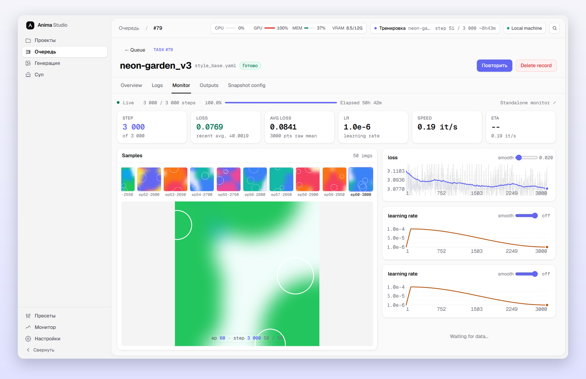
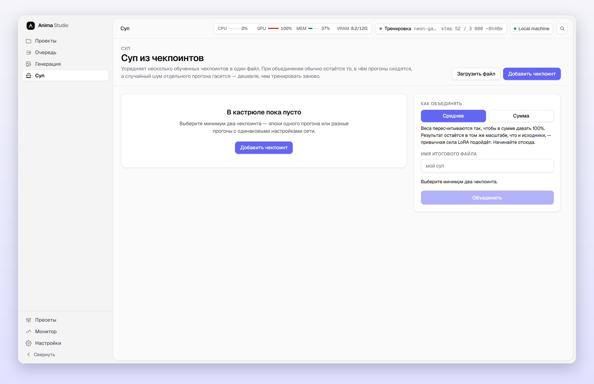
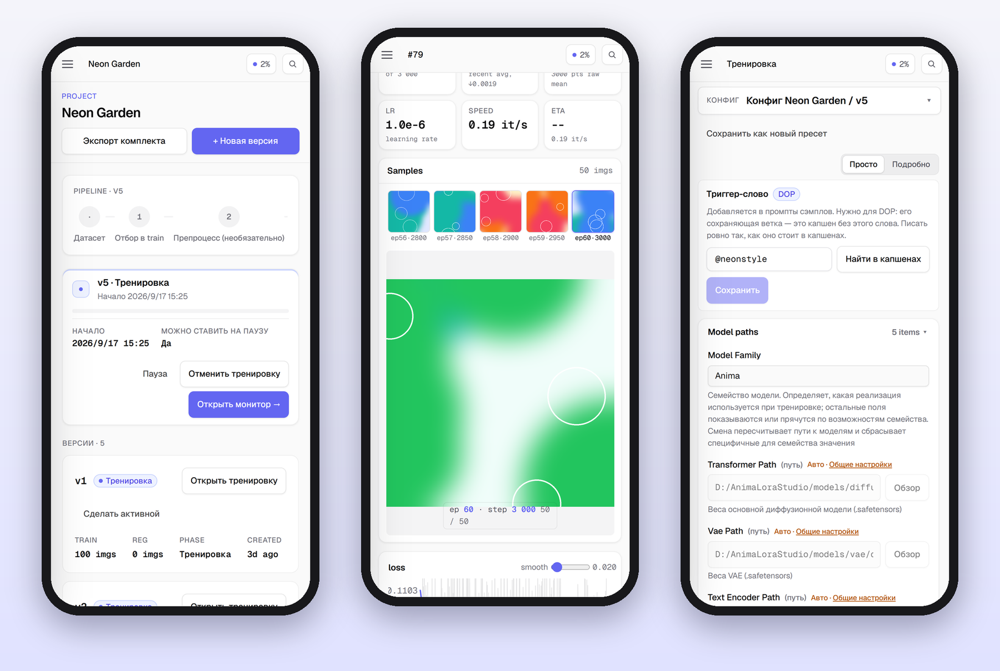
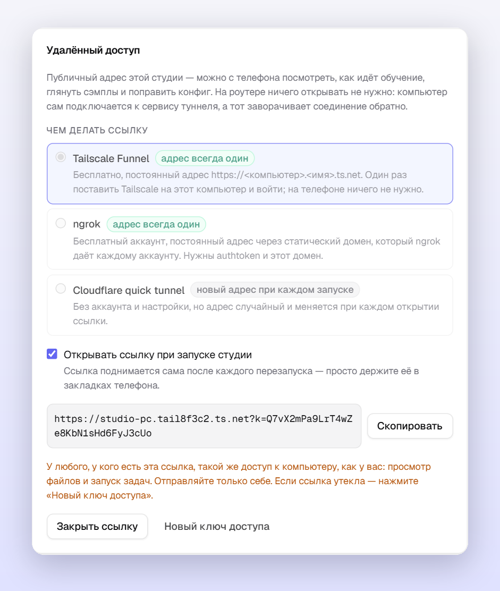
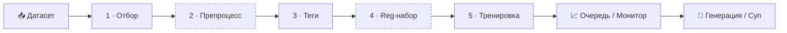

<div align="center">

# AnimaTrainHub

**Локальная студия для обучения LoRA / LoKr под Anima и Krea 2.**<br>
От сырых картинок до тестовых генераций в одном окне браузера, в том числе с телефона.

[](README.md)
[](CHANGELOG.md)
[](LICENSE)
[](#требования)
[](#)

[Возможности](#возможности) · [Отличия от оригинала](#чем-отличается-от-оригинала) · [Быстрый старт](#быстрый-старт) · [С телефона](#доступ-с-телефона) · [Документация](#документация)

<br>



</div>

<br>

## Коротко

<table>
<tr>
<td width="50%" valign="top">

**🧭 Весь цикл в одном месте**<br>
Датасет → отбор → препроцесс → теги → reg-набор → тренировка → очередь → монитор → генерация. Каждый шаг подсвечен в боковой панели, конфиги сохраняются сами.

</td>
<td width="50%" valign="top">

**📖 Каждая настройка объясняет себя**<br>
У всех 182 параметров тренировки есть понятное описание и рекомендуемое значение на русском или английском, прямо рядом с полем.

</td>
</tr>
<tr>
<td valign="top">

**📱 Работает с телефона по постоянной ссылке**<br>
Tailscale Funnel или ngrok дают адрес, который не меняется. Галочка «открывать при запуске» поднимает ссылку сама, а интерфейс свёрстан под экран телефона.

</td>
<td valign="top">

**🪶 Тренировка даже на 6 ГБ**<br>
Block swap, fp8, кеши латентов и текстового энкодера, NaViT-упаковка. До запуска видно, сколько будет шагов, сколько займёт и влезет ли в VRAM.

</td>
</tr>
</table>

<br>

## Возможности

### 🗂 Датасет
- **Импорт** картинок и zip-архивов перетаскиванием или с диска сервера, сбор с Booru, статистика форматов и размеров.
- **Отбор в train**: две панели «датасет → train», папки концептов `N_name` с повторами, отдельный валидационный набор.
- **Препроцесс** *(по желанию)*: поиск дублей по перцептивному хешу, апскейл (ESRGAN / Real-ESRGAN), кроп с кластеризацией по соотношению сторон, дорисовка (inpaint). Любое действие можно откатить.
- **Редактор тегов**: массовые добавление / удаление / замена, дедуп, распределение тегов, автодополнение по словарю, точки восстановления.
- **Reg-набор**: генерация базовой моделью (приор в стиле DreamBooth) или сбор с Booru по распределению тегов train.

### 🎛 Тренировка
- **Проекты и версии**: один датасет и много версий, у каждой свой конфиг, reg-набор и результаты.
- **Пресеты в обе стороны**: сохранить конфиг версии как общий пресет или взять пресет в версию.
- **Форма конфига**: режимы «Просто» / «Подробно», оглавление разделов, предпросмотр YAML, автосохранение.
- **Честная оценка до старта**: число шагов, примерное время (по вашему прошлому прогону) и проверка VRAM той же арифметикой, что и защита от OOM.
- **GPU-очередь**: пауза с сохранением прогресса, возобновление, заморозка очереди, отложенный старт.
- **Мониторинг**: кривые loss / LR, сэмплы по шагам, логи, файлы результатов с выгрузкой в zip.



### 🧪 Алгоритмы
| | |
|---|---|
| **Адаптеры** | LoRA и LyCORIS (LoKr / LoHa, DoRA, rs-LoRA, dropout), ранги по слоям через `lora_rank_rules` |
| **Оптимизаторы** | AdamW, Lion, Automagic, Prodigy, Prodigy + ScheduleFree ([как выбрать](docs/user-guide/optimizers.md)) |
| **Loss** | MSE / Huber, взвешивание `min_snr`, `cosmap`, `detail_inv_t` и др. |
| **Таймстепы** | `uniform`, `logit_normal`, `mode`, `mixed_uniform`, InfoNoise, Style-Friendly SNR ([подробнее](docs/style-friendly-snr.md)) |
| **Против переобучения** | EMA весов адаптера и DOP — сохранение выхода без триггера ([подробнее](docs/ema-and-dop.md)) |
| **Память** | block swap (Anima от 6 ГБ, Krea 2 на 16 ГБ), fp8, кеши, NaViT-упаковка ([подробнее](docs/navit-packing.md)) |
| **Внимание** | xformers / flash-attn / PyTorch SDPA |

### 🎨 Генерация и сравнение
- Одиночные картинки и XY-матрицы по параметрам через постоянно запущенный демон.
- Промпты прямо из капшенов датасета, несколько LoRA с отдельными весами.
- **Суп из чекпоинтов**: усреднить несколько эпох или прогонов в один файл и сразу проверить. Несовместимые чекпоинты отсекаются заранее с объяснением.



### ⚙️ Окружение
- Первый запуск сам создаёт `venv`, подбирает сборку PyTorch под драйвер (cu118–cu130) и ставит зависимости.
- Все кеши (pip, HuggingFace, torch, npm) остаются в папке проекта.
- Скачивание моделей в один клик (HuggingFace, свой зеркальный адрес или ModelScope), свои VAE и текстовые энкодеры, локальные базовые модели.
- Режимы **Local** и **Colab**, интерфейс на русском и английском, палитра команд по `Ctrl + K`.

Результат сохраняется в формате `lora_unet_*` и открывается в ComfyUI без конвертации.

<br>

## Доступ с телефона



Все страницы свёрстаны под телефон: колонки выстраиваются друг под другом, монитор занимает всю ширину, ручки кропа и галочки на миниатюрах работают пальцем.

<table>
<tr>
<td width="46%" valign="top">

</td>
<td valign="top">

**Настройки → Удалённый доступ**

| Способ | Адрес | Что нужно |
|---|---|---|
| **Tailscale Funnel** | постоянный `https://<компьютер>.<сеть>.ts.net` | Tailscale на этом компьютере, один раз войти |
| **ngrok** | постоянный, на бесплатном статическом домене | authtoken и домен из кабинета ngrok |
| **Cloudflare** | новый при каждом запуске | ничего |

1. Выберите способ. Для постоянной ссылки удобнее всего Tailscale.
2. Нажмите **«Открыть ссылку»**. При первом запуске Tailscale может попросить разрешить Funnel: ссылка на это появится прямо в окне.
3. Включите **«Открывать ссылку при запуске студии»** и сохраните ссылку в закладки телефона.

На роутере ничего открывать не нужно. В ссылке есть постоянный ключ доступа, без него студия не отвечает. Если ссылка утекла, кнопка **«Новый ключ доступа»** отключит все старые.

</td>
</tr>
</table>

<br>

## Чем отличается от оригинала

> [!NOTE]
> AnimaTrainHub вырос из форка [WalkingMeatAxolotl/AnimaLoraStudio](https://github.com/WalkingMeatAxolotl/AnimaLoraStudio). Ядро тренировки и бэкенд синхронизированы с upstream **v0.20.2**. Всё, с чем человек работает руками, переделано.

<table>
<tr>
<td width="33%" valign="top">

**🎨 Интерфейс**<br>
Новый дизайн на [Tailark](https://tailark.com) (zinc + indigo, Geist). Полностью на русском и английском, китайского в UI не осталось.

</td>
<td width="33%" valign="top">

**📖 Объяснения**<br>
У каждой настройки понятное описание и рекомендуемое стартовое значение.

</td>
<td width="33%" valign="top">

**⏱ Честная оценка**<br>
Шаги, время и VRAM видны до нажатия «Запустить».

</td>
</tr>
<tr>
<td valign="top">

**📱 Телефон и удалённый доступ**<br>
Мобильная вёрстка всех страниц и постоянная ссылка с автозапуском и ключом доступа.

</td>
<td valign="top">

**🧪 Инструменты тренировки**<br>
Суп из чекпоинтов, EMA, DOP с полем триггер-слова, Style-Friendly SNR.

</td>
<td valign="top">

**☁️ Local / Colab**<br>
Режим запуска выбирается при первом старте; от него зависят адрес, браузер и расположение данных.

</td>
</tr>
</table>

**Перенесено из upstream v0.21–v0.25:** block swap на стороне тренировки (Krea 2 на 16 ГБ, Anima на 6 ГБ), исправления утечек памяти и ложных OOM; NaViT-упаковка теперь работает вместе с block swap.<br>
**Не перенесено:** block swap при генерации, переработка страницы оценки из v0.22, выбор GPU на мульти-GPU машинах.

<br>

## Быстрый старт

<table>
<tr>
<td width="33%" valign="top">

### 1 · Подготовка

- драйвер NVIDIA
- Python **3.10+**
- Node.js **18+** (собирает интерфейс)
- Git

</td>
<td width="33%" valign="top">

### 2 · Запуск

```bash
git clone https://github.com/DualChimerra/AnimaTrainHub
cd AnimaTrainHub
```

**Windows**: `AnimaLoraStudio.exe` или `studio.bat`<br>
**Linux / macOS**: `./studio.sh`

</td>
<td width="33%" valign="top">

### 3 · Модели

Откройте **Настройки → Модели** и нажмите скачать для своего семейства. Файлы лягут в `./models/`.

Дальше создайте проект и идите по боковой панели.

</td>
</tr>
</table>

> [!TIP]
> Первый запуск займёт время: создаётся окружение, скачивается PyTorch под вашу видеокарту и собирается интерфейс. Потом сама откроется <http://127.0.0.1:8765>.

### Как проходит работа над LoRA



<sub>Шаги с пунктиром необязательны.</sub>

<details>
<summary><b>По шагам</b></summary>

<br>

| Шаг | Что делаете |
|---|---|
| **Проекты → Новый проект** | Первая версия создаётся сама |
| **Датасет** | Загрузите картинки или zip с капшенами, либо соберите с Booru |
| **Отбор** | Перенесите нужное в train, разложите по концептам, отложите валидацию |
| **Препроцесс** | Уберите дубли, увеличьте мелкие картинки, обрежьте — или пропустите |
| **Теги** | Почистите капшены массовыми операциями |
| **Reg-набор** | Сгенерируйте базовой моделью, соберите с Booru — или пропустите |
| **Тренировка** | Выберите пресет, поправьте параметры, для DOP укажите триггер-слово, нажмите **«Запустить тренировку»** |
| **Очередь / Монитор** | Смотрите loss, сэмплы и логи; ставьте на паузу и возобновляйте |
| **Генерация** | Проверьте эпохи одиночными картинками или XY-матрицей, смешайте лучшие в суп |

</details>

<details>
<summary><b>Команды и флаги</b></summary>

```bash
python -m studio              # собрать UI при необходимости и запустить сервер
python -m studio dev          # режим разработки: Vite :5173 + uvicorn :8765 --reload
python -m studio build        # только собрать UI
python -m studio test         # pytest + vitest

studio.bat --torch=cu128      # принудительно выбрать сборку PyTorch
studio.bat --reinstall        # пересоздать venv (studio_data сохраняется)
AnimaLoraStudio.exe --check   # диагностика: Python, venv, GPU, пути кешей

python tools/download_models.py                  # все модели с HuggingFace
python tools/download_models.py --modelscope     # через ModelScope
python tools/download_models.py --endpoint URL   # через своё зеркало
```

</details>

<br>

## Требования

<table>
<tr>
<td width="50%" valign="top">

#### 🖥 Железо

| | Минимум | Рекомендуется |
|---|---|---|
| **GPU** | NVIDIA 6 ГБ | NVIDIA 16 ГБ+ |
| **ОЗУ** | 16 ГБ | 32 ГБ |
| **Диск** | SSD, ~20 ГБ | SSD с запасом |

<sub>6 ГБ хватает для Anima с block swap. Block swap закрепляет до 3.6 ГБ ОЗУ для Anima и ~11 ГБ для Krea 2 fp8.</sub>

</td>
<td width="50%" valign="top">

#### 🧠 Модели

| Модель | Основа | Текстовый энкодер |
|---|---|---|
| [**Anima**](https://huggingface.co/circlestone-labs/Anima) | Cosmos-Predict2 DiT, 2B | Qwen3-0.6B |
| **Krea 2** | single-stream MMDiT, поддерживается fp8-база | Qwen3-VL-4B |

<sub>Обе обучают LoRA, LoKr и LoHa; результат открывается в ComfyUI как есть.</sub>

</td>
</tr>
</table>

> [!WARNING]
> Видеокарты AMD и Apple Silicon не поддерживаются.

<br>

## Документация

<table>
<tr>
<td width="50%" valign="top">

**📘 [Руководство](docs/user-guide/)**<br>
Капшены и теги, регуляризация, оптимизаторы, параметры тренировки, свои модели.

</td>
<td width="50%" valign="top">

**🧪 Алгоритмы**<br>
[EMA и DOP](docs/ema-and-dop.md) · [Style-Friendly SNR](docs/style-friendly-snr.md) · [NaViT-упаковка](docs/navit-packing.md)

</td>
</tr>
<tr>
<td valign="top">

**🏗 Архитектура**<br>
[Устройство студии](docs/architecture/) · [Архитектурные решения](docs/adr/) · [Бэкенд и фронтенд](studio/README.md) · [Ядро тренировки и плагины](runtime/training/README.md)

</td>
<td valign="top">

**🤝 Проект**<br>
[Как участвовать](CONTRIBUTING.md) · [История версий](CHANGELOG.md) · [Сторонние компоненты](THIRD_PARTY_NOTICES.md)

</td>
</tr>
</table>

<details>
<summary><b>Структура репозитория</b></summary>

```
AnimaTrainHub/
├── runtime/        # ядро тренировки, генерация, демон инференса (работает и из CLI)
├── studio/         # веб-студия: FastAPI (api / services / domain / infrastructure / workers)
│   └── web/        # интерфейс: React + Vite + Tailwind
├── modeling/       # реализации моделей
├── utils/          # общие утилиты тренировки
├── tools/          # CLI: скачивание моделей, выбор torch, установка flash-attn, сборка лаунчера
├── models/         # веса и токенизаторы (крупные файлы не в git)
├── studio_data/    # проекты, база, пресеты, задачи (создаётся при первом запуске)
└── docs/           # документация
```

</details>

<br>

## Благодарности

| Что | Откуда |
|---|---|
| **Оригинальный проект** | [WalkingMeatAxolotl/AnimaLoraStudio](https://github.com/WalkingMeatAxolotl/AnimaLoraStudio) |
| **Скрипты тренировки** | [Moeblack/AnimaLoraToolkit](https://github.com/Moeblack/AnimaLoraToolkit) |
| **Модель и VAE** | [circlestone-labs/Anima](https://huggingface.co/circlestone-labs/Anima) |
| **Адаптеры** | [LyCORIS](https://github.com/KohakuBlueleaf/LyCORIS) |
| **Всё остальное** | [THIRD_PARTY_NOTICES.md](THIRD_PARTY_NOTICES.md) |

## Лицензия

Код: **GPL-3.0** ([LICENSE](LICENSE)). Часть сторонних компонентов (NVIDIA Cosmos, Wan2.1) под **Apache-2.0** ([LICENSE-APACHE](LICENSE-APACHE)).

> [!IMPORTANT]
> У весов моделей (Anima, Qwen, VAE) свои лицензии, в том числе с некоммерческими ограничениями. Проверьте карточки моделей, прежде чем использовать обученную LoRA в коммерческих целях.

<br>

<div align="center">

**AnimaTrainHub** · для тех, кто обучает LoRA, а не читает скрипты тренировки

<sub>На скриншотах демонстрационные данные.</sub>

</div>
